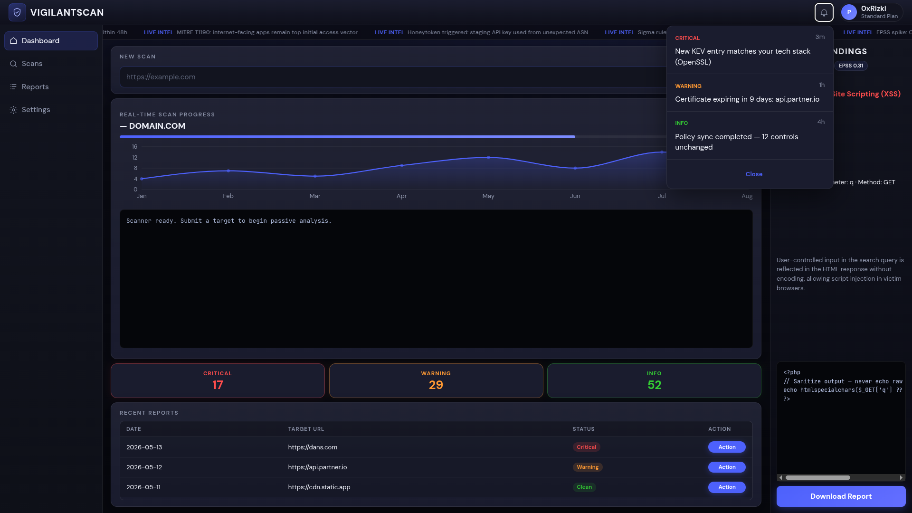
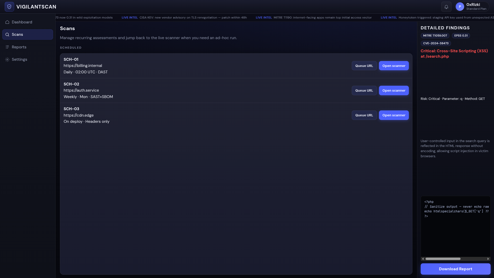
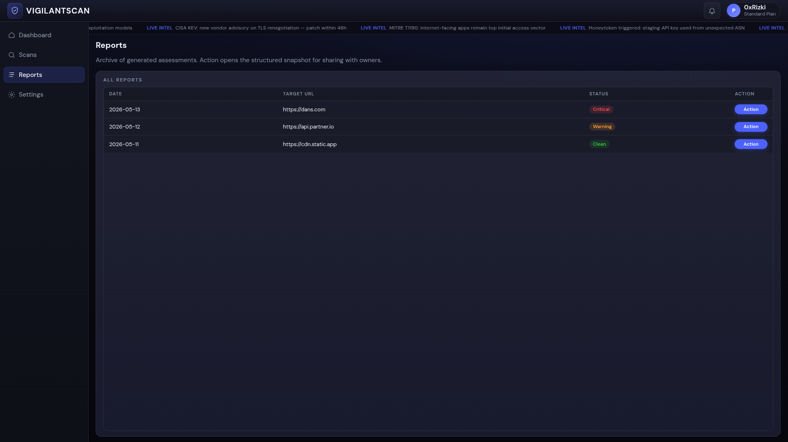
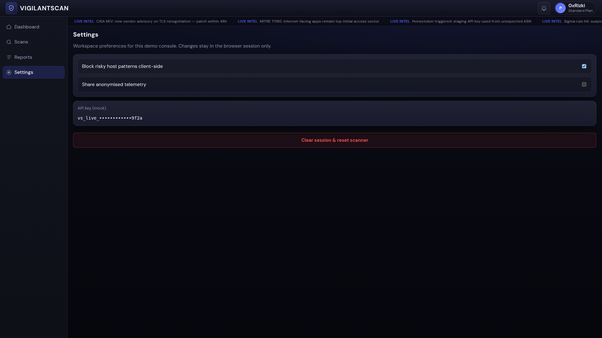

# VigilantScan — Website Security Scanner

> Production-grade DAST (Dynamic Application Security Testing) dashboard

---

## Screenshots

### Dashboard



### Scans



### Reports



### Settings



---

##  Project Structure

```
vigilantscan/
├── assets/
│   └── images/
│       ├── Dashboard.png
│       ├── Reports.png
│       ├── Scans.png
│       └── Settings.png
│
├── public/
│   ├── index.html
│   └── favicon.svg           # Shield icon
│
├── src/
│   ├── App.jsx               ← Root component + layout composition
│   ├── main.jsx              ← ReactDOM.createRoot entry point
│   │
│   ├── styles/
│   │   └── theme.js          ← Design tokens (colors, space, radii, fonts)
│   │
│   ├── data/
│   │   └── mockData.js       ← All static/simulated data (logs, vulns, reports)
│   │
│   ├── hooks/
│   │   └── useScan.js        ← Scan simulation + terminal scroll hooks
│   │
│   ├── lib/
│   │   └── utils.js          ← Helpers (formatDate, severityColor, etc.)
│   │
│   └── components/
│       ├── layout/
│       │   ├── Sidebar.jsx   ← Left navigation + system status
│       │   └── TopBar.jsx    ← Header: logo, search, bell, avatar
│       │
│       ├── dashboard/
│       │   ├── NewScanHero.jsx          ← URL input + START SCAN button
│       │   ├── VulnerabilitySummary.jsx ← Critical/Warning/Info score cards
│       │   └── RecentReports.jsx        ← Paginated reports table
│       │
│       ├── scan/
│       │   ├── Terminal.jsx      ← Live log window with progress bar
│       │   └── ActivityChart.jsx ← 24h bar chart (recharts)
│       │
│       ├── findings/
│       │   ├── FindingsPanel.jsx ← Right sidebar panel wrapper
│       │   └── FindingCard.jsx   ← Accordion card: probe + remediation
│       │
│       └── ui/
│           ├── Badge.jsx         ← Severity badge (Critical/Warning/Info/Passed)
│           ├── Card.jsx          ← Surface container with border
│           └── Icons.jsx         ← All SVG icon components
│
├── package.json
└── vite.config.js
```

---

##  Vulnerability Severity System

| Level    | Use Case                           |
|----------|------------------------------------|
| CRITICAL | SQL Injection, RCE, exposed files  |
| WARNING  | Weak TLS, outdated versions        |
| INFO     | Best practice, missing headers     |
| PASSED   | Clean test result                  |

---

## License
MIT — Built with VigilantScan design system
